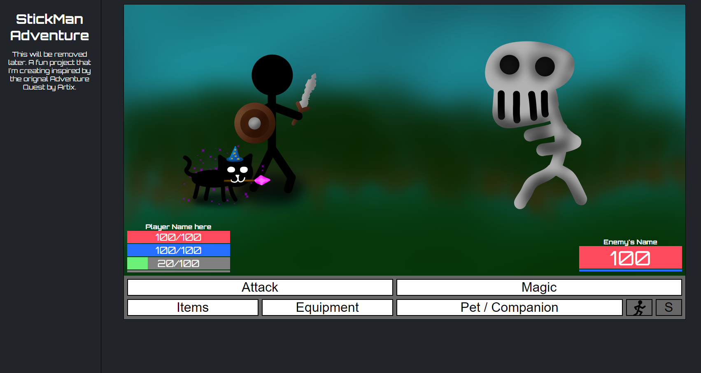

# StickMan-Adventure

## Howdy there!
This is a fun project that I'm creating inspired by the orignal Adventure Quest by Artix. 

I started creating this project because I wanted to have some fun with front-end coding so I decided to make another game in which is inspired by an game back in my younger days. 

## What can you do?
As if now, the user can:

- Have popups when pressing on Magic, Items, Equipment, Pet/Companion buttons
- Hover over both the player or enemy stat health, mana, and sp bar area to show their stats
- You can change the action bar skin by pressing on the S button
- Image switching your character when equipping gear in your equipment popup
- Popup auto closes when you press on a button in that popup

## Features
Some other cool visual effects

- Button hover shade
- Button Click light-up
- Equipped gear will be shown

## Live Coding
Here is my [Youtube](https://www.youtube.com/channel/UCAAC8sC_qN_H1nhq8eOVzUA/featured) as I'll be starting to stream me coding this project since it'll be cool to talk to other people and maybe get some some tips and tricks as I'm am still a novice coder as if the date I'm writing this.